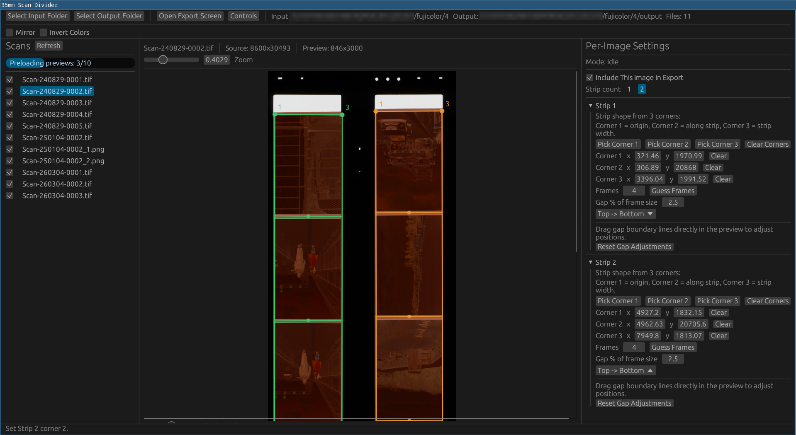

# Perfora (Rust MVP)

Desktop app for splitting 35mm strip scans into individual frames.




## Run

Download a binary from Releases and run it.
Currently, only Linux release binaries are provided (if there someone is iterested in alternative platforms, ping me in issues)

## Why?

I use a flatbed scanner for negative scans.  
I previously used VueScan with automatic frame detection, but detection often fails (in VueScan and other tools), so getting clean frame boundaries takes too much manual prep before each scan.
Most of the tool is vibe-coded, please do not take this code as example.

## Building

Local build:

```bash
cargo run
```

Release-style local build (matches CI LTO profile):

```bash
cargo build --profile release-lto
```

## Workflow

- I recommend using confg-file (format provided later in readme), especially if you scan a lot of film. It makes export process a bit easier.
- Select an input folder containing `.tif/.tiff/.png/.jpg/.jpeg`.
- 1 or 2 strips per image (default: `2`).
- Draw strip rectangles directly on preview.
- Set frame direction (`Left->Right`, `Right->Left`, `Top->Bottom`, `Bottom->Top`).
- Guess frame count from strip rectangle size + target aspect ratio (`W:H`, default `3:2`).
- Set frame count and gap (`% of frame size`) per strip.
- Move gap boundaries directly on preview.
- Set optional mirroring and color inversion.
- Open export tab
- Set auto-contrast using percentile clipping from a configurable centered ROI area. (defaults work fine)
- Select output bit depth mode:
  - preserve source bit depth (when possible),
  - or convert to 8-bit.
- Select export format: preserve source, JPEG, PNG, or TIFF.
- Fill Metadata fields: camera make/model, author, scan datetime, film, description, notes.
- Fill Metadata preset-assisted inputs (type freely or pick from dropdown) for camera make/model, film, and author.
- Start export.

## Output Naming

Files are exported as:

`<global_index>__<source_basename>__strip<N>__frame<NN>.<ext>`

Example:

`000123__Scan-240826-0001__strip1__frame04.tiff`

## Notes

- File processing order is alphabetical by filename.
- If output folder is not manually set, default is `<input>/output`.
- Defaults:
  - strip count: `2`
  - frame direction: `Top -> Bottom`
  - export format: `PNG`
  - bit depth: `Convert to 8-bit`
- Per-image geometry settings are session-only unless manually re-created.

## Optional Config (`perfora.toml`)

Config lookup order:
1. `PERFORA_CONFIG=/path/to/file.toml`
2. executable (`current_exe`) directory: `perfora.toml` or `.perfora.toml`
3. current working directory: `perfora.toml` or `.perfora.toml`

If defaults are invalid or don't match preset lists, the app will shows a warning banner in the top bar.

Example:

```toml
[defaults]
strip_count = 2
frame_direction = "top_to_bottom"
export_format = "png"
bit_depth = "convert_8bit"
camera_make = "Nikon"
camera_model = "F5"
film_stock = "Kodak Portra 400"
author = "Person A"

[presets]
films = ["Kodak Portra 400", "Kodak Gold 200", "Ilford HP5+"]
authors = ["Person A", "Person B", "Friend A"]

[[presets.cameras]]
make = "Nikon"
model = "F5"

[[presets.cameras]]
make = "Nikon"
model = "L35AF"
```
